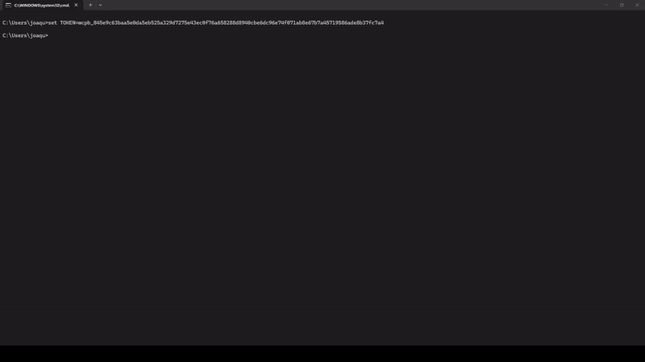
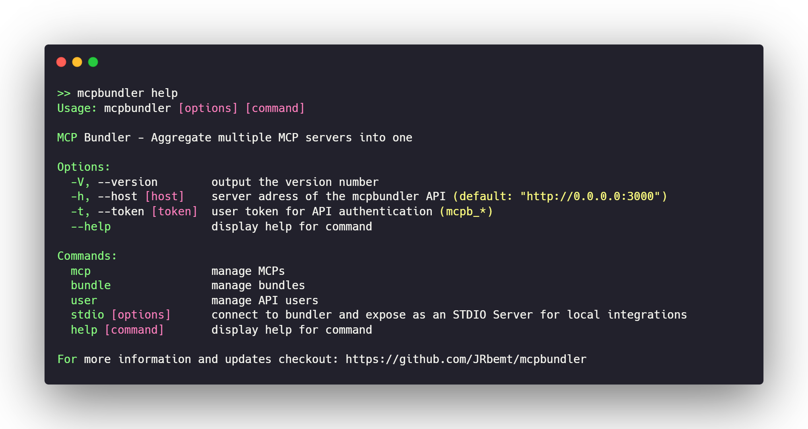

<h1 align="center">
  MCPbundler
</h1>
<p align="center">
  Aggregate multiple MCP servers into one unified interface.
</p>


MCP Bundler lets you combine multiple MCP servers into a single endpoint. Your AI agent connects once and gets access to tools, resources, and prompts from all configured servers - no need to manage multiple connections. MCP's have tremendous potential, but can not yet be managed, configured and deployed in a user-friendly way. 
This project solves that for HTTP/SSE MCP's.

**Without bundler**  
You have 5 agents running. You want to give them access to a new MCP server. Without bundler: update config on all 5 agents and restart them.

**With bundler**  
Add the MCP to the bundle once. All 5 agents already pointing at that bundle endpoint now have access. Done.


<p align="center">
  
</p>


## Tabel of Contents


## Use Cases

- **Development**: Manage multiple development MCPs from one endpoint
- **Production**: Centralize MCP access with proper authorisation controls
- **Teams**: Share bundles of MCPs across team members
- **Multi-tenant**: Manage many MCPs with many users in an organization

**Roadmap:**

- [ ] Full OAuth2 support
- [ ] OpenAPI Docs
- [ ] Web UI
- [ ] Fine-grained permissions
- [ ] Metrics dashboard for logs and metering

# 1. Getting Started
<details>

<summary>A quickstart guide</summary>

## 1.1 Installation
The server can be run locally (sqllite) or in production mode (postgres).
To run the server in production mode, copy the repository and run the docker-compose.yml file.
```bash
git clone https://github.com/jrbemt/mcpbundler
cd mcpbundler
cp .env.example .env
# Edit .env: set POSTGRES_*, ENCRYPTION_KEY, ROOT_USER_*
docker compose up
```

## 1.2 Quick Start Guide
In this quickstart guide we will get you to run the server, and to connect your agent/client to your first bundle. 
Which should look like this:
<p align="center">
  
</p>


### 1.2.1 Add an MCP Server
Once you have the server running it is time to add your first mcpp. You can interact with the API through HTTP or the CLI tool. For most endpoints authentication is required with an API user token. The root admin token is presented when first starting the server, other user API tokens are either generated by a pre-existing user or through the **self-service endpoint** (if enabled).

We will add our first MCP that runs locally and uses the default authentication strategy ('NONE'), using:
``` bash
mcpbundler --token %TOKEN% mcp add "files" "http://localhost:3001/mcp" --description "files for the R&D team"
```

### 1.2.33 Create a Bundle
Next we will create a bundle. A bundle is a subset of MCP's. These bundles can be distributed easily but keep the configuration centralized.
Bundles can optionally prescribe what MCP tools are allowed inside the bundle using regex patterns.

```bash
mcpbundler --token %TOKEN% bundle create "R&D team" "Basic R&D tools"
mcpbundler --token %TOKEN% bundle mcp add %BUNDLE_ID% "files"
mcpbundler --token %TOKEN% bundle show %BUNDLE_ID%
```
### 1.2.4 Generate Bundle Token
Finally we will generate a personal bundle access token for the created bundle. 
Any user can create such an access token, which will be used to give a client access to all MCP's in the bundle.

```bash
mcpbundler --token %TOKEN% bundle token generate %BUNDLE_ID% --name "Mike's PC" --description "HP Laptop"
# Optionally bind personal authentication credentials for a certain MCP to this token, 
# authentication strategy must be set to 'USER_SET'
mcpbundler --token %TOKEN% bundle token cred bind %BUNDLE_TOKEN% "files" [--auth-bearer, --auth-basic, --auth-apikey] "..."
```
This access token is used as a default Authorization Bearer header.Another option is to bypass the bundles, and use the wildcard token (if enabled). This will give access to all (pre-authenticated) MCP's in te registry. By default this option is enabled and accesible using "*" for the Authorization Bearer token (can also be set to "" to require no bearer token at all).

</details>

# 2. Command Line Interface (CLI)

<p align="center">
  
</p>


The CLI app enables calling the HTTP endpoints through an cli interface.
The CLI requires a --token, and --host (default: localhost).

# 3. Bundler

The bundler can be reached by any mcp client on:
```
[base]/mcp
```
For using the bundler, no user account is needed. Just a bundle access (or a wildcard) token.

# 4. API

All management endpoints are under `/api`. Most require an API user token passed via the `Authorization: Bearer <token>` header. The root admin token is printed to the console on first startup.

<details>
<summary>4.1 Users</summary>

User accounts authenticate to the management API. The system is hierarchical: users can create other users and manage their descendants.

| Method | Endpoint | Auth | Description |
|--------|----------|------|-------------|
| `POST` | `/api/users/self` | None | Self-service registration (if enabled) |
| `POST` | `/api/users` | User with `CREATE_USER` | Create a new user |
| `GET` | `/api/users` | User with `LIST_USERS` | List all users |
| `GET` | `/api/users/me` | User | Get own profile with created users |
| `PUT` | `/api/users/me` | User | Update own profile |
| `POST` | `/api/users/me/revoke` | User | Revoke own API key |
| `POST` | `/api/users/:userId/revoke` | User | Revoke a user you created (cascades to descendants) |
| `GET` | `/api/users/by-name/:name` | Admin | Get user by name |

</details>

<details>
<summary>4.2 Permissions</summary>

Four permission scopes can be assigned to an user account:

| Permission | Description |
|------------|-------------|
| `CREATE_USER` | Create new users |
| `ADD_MCP` | Add MCP servers to the registry |
| `LIST_USERS` | List all users in the organization |
| `VIEW_PERMISSIONS` | View other users' permissions |

A user creating another user can only assign permissions equal to or more restrictive than their own.

| Method | Endpoint | Auth | Description |
|--------|----------|------|-------------|
| `GET` | `/api/permissions` | None | List all permission types |
| `GET` | `/api/permissions/me` | User | Get own permissions |
| `GET` | `/api/permissions/user-id/:id` | User with `VIEW_PERMISSIONS` | Get user permissions |
| `POST` | `/api/permissions/user-id/:id/add` | User | Add permissions (optional cascade via `propagate`) |
| `POST` | `/api/permissions/user-id/:id/remove` | User | Remove permissions (cascades to descendants) |

</details>

<details>
<summary>4.3 MCPs</summary>

The MCP endpoints are for maintaining the MCP registry. Each MCP has a unique namespace.

| Method | Endpoint | Auth | Description |
|--------|----------|------|-------------|
| `GET` | `/api/mcps` | User | List all MCPs |
| `POST` | `/api/mcps` | User with `ADD_MCP` | Add a new MCP |
| `GET` | `/api/mcps/:namespace` | User | Get MCP by namespace |
| `PUT` | `/api/mcps/:namespace` | User | Update MCP (owner or ancestor) |
| `DELETE` | `/api/mcps/:namespace` | User | Delete MCP (owner or ancestor, cascades to bundles) |
| `DELETE` | `/api/mcps/all` | User | Bulk delete all MCPs created by you and your descendants |

</details>

<details>
<summary>4.4 Bundles</summary>

A bundle groups a subset of MCPs behind a single access token. Bundles can restrict which tools, resources, and prompts are exposed using regex patterns.

| Method | Endpoint | Auth | Description |
|--------|----------|------|-------------|
| `GET` | `/api/bundles` | User | List all bundles |
| `GET` | `/api/bundles/me` | User | List bundles created by you and your descendants |
| `POST` | `/api/bundles` | User | Create a bundle |
| `GET` | `/api/bundles/:id` | User | Get bundle details with MCPs |
| `POST` | `/api/bundles/:id` | User | Add MCP(s) to bundle by namespace |
| `DELETE` | `/api/bundles/:id` | User | Delete bundle (owner or ancestor) |
| `DELETE` | `/api/bundles/:id/:namespace` | User | Remove MCP from bundle |

**Bundle Token endpoints:**

| Method | Endpoint | Auth | Description |
|--------|----------|------|-------------|
| `POST` | `/api/bundles/:id/tokens` | User | Generate a bundle access token |
| `GET` | `/api/bundles/:id/tokens` | User | List tokens for a bundle |
| `DELETE` | `/api/bundles/:id/tokens/:tokenId` | User | Revoke a token |

</details>

<details>
<summary>4.5 Credentials</summary>

These endpoints enable binding user-specific MCP authentication credentials to your private bundle access token.
These endpoints use the `X-Bundle-Token` header for authentication instead of the API user token.

| Method | Endpoint | Auth | Description |
|--------|----------|------|-------------|
| `GET` | `/api/credentials` | `X-Bundle-Token` | List all credentials bound to this token |
| `POST` | `/api/credentials/:namespace` | `X-Bundle-Token` | Bind credentials to a token+MCP combination |
| `PUT` | `/api/credentials/:namespace` | `X-Bundle-Token` | Update credentials |
| `DELETE` | `/api/credentials/:namespace` | `X-Bundle-Token` | Remove credentials |

</details>

<details>
<summary>4.6 MCP Authentication Strategies</summary>

Each MCP server can use one of three authentication strategies:

| Strategy | Description |
|----------|-------------|
| `NONE` | No authentication required to connect to the upstream MCP |
| `MASTER` | Shared credentials configured when adding the MCP. All bundle tokens use the same credentials. |
| `USER_SET` | Per-token credentials. Each bundle token holder binds their own credentials via the `/api/credentials` endpoints. |

`USER_SET` enables scenarios where multiple users share a bundle but each uses their own credentials to access the underlying MCP servers.

Supported credential formats: Bearer token, Basic auth, API key.

</details>

<details>
<summary>4.7 Metrics</summary>

```
GET /metrics
```

Returns server metrics including active sessions, upstreams, and health status.

</details>


# 5. Contributing 🤝

Built with ❤️ for the MCP community

Contributions are welcome! Please see [CONBUTING.md](CONTRIBUTING.md) for guidelines.


